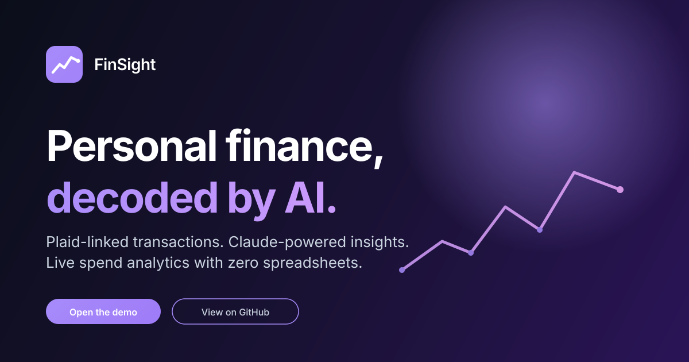

# FinSight - https://finsight-rose.vercel.app/

> Personal finance, decoded by AI. Plaid-linked transactions, Claude-powered insights, and a beautiful dashboard.

<p align="center">
  
</p>

<p align="center">
  <a href="#live-demo"></a>
  
  
  
</p>

FinSight links your bank with Plaid, syncs every transaction into PostgreSQL with idempotent upserts, asks Claude to narrate the story behind the numbers, and renders the whole thing in a thoughtfully designed React dashboard.

---

## Live demo

- **App:** _to be added once deployed_
- **One-click demo lane:** the landing page exposes a "Demo user" button (seeded First Platypus Bank, ~50 transactions, AI insights already generated)
- **Demo credentials (also work on the login form):** `demo@finsight.local` / `demoFinSight!2026`

> No real money, real banks, or real customers. Everything is sandbox.

## What it does

| Surface | Description |
| --- | --- |
| **Plaid Link** | OAuth handoff for 12,000+ institutions. Public token exchanged for an opaque access token persisted server-side. |
| **Transaction sync** | Streaming sync into Postgres. Idempotent upserts driven by `plaid_transaction_id`. Cursors persisted per item. |
| **Spending dashboard** | Category breakdown, top merchants, money-flow ribbon, full transaction ledger with month/amount filters. |
| **AI narration** | Claude generates summary + top categories + anomalies + recommendations. Runs async, polled with cancellation + backoff. |
| **Auth** | Email/password registration, bcrypt at rest, HS256 access JWTs (15 min), opaque SHA-256 refresh tokens (7 days), single-flight refresh on 401. |
| **Demo lane** | Seed command provisions the demo user, links First Platypus Bank, runs a sync, generates initial insights. |

## Tech stack

**Frontend** — React 18 · TypeScript · Vite · Tailwind v4 · React Router v6 · Recharts · Axios · `react-plaid-link`

**Backend** — Go · chi router · PostgreSQL · `golang-jwt/jwt/v5` · `golang.org/x/crypto/bcrypt` · Plaid Go SDK · Anthropic Claude API

**Infra** — Frontend on Vercel, backend on Railway, embedded SQL migrations applied at boot.

## Architecture highlights

- **Async insight pipeline.** Plaid reconciliation completes on the user-facing path in well under a second. Claude regenerates the narrative on a background goroutine with a 120s timeout; the dashboard polls with a cancellation guard until the timestamp advances.
- **Single-flight refresh.** Axios response interceptor catches one 401, kicks off a single refresh, queues every concurrent request behind that one promise, retries them all on success, and forces a sign-out on failure.
- **Embedded migrations.** `//go:embed migrations/*.sql` bundles SQL into the binary. On boot we ensure a `schema_migrations` ledger table and apply any pending versions inside a transaction. Railway-friendly out of the box.
- **Env-driven CORS allowlist.** `ALLOWED_ORIGINS` (comma-separated) decides which origins receive the CORS headers. Dev falls back to `localhost:3000` + `localhost:5173`.
- **No `any` types.** Strict TypeScript throughout. Every Plaid + Claude shape is typed in `frontend/src/types/index.ts`.

## Local setup

### Prerequisites

- Go ≥ 1.21
- Node.js ≥ 20
- PostgreSQL 14+
- Plaid sandbox credentials ([plaid.com/docs/quickstart](https://plaid.com/docs/quickstart/))
- Anthropic API key for Claude

### Backend

```bash
cd backend
cp .env.example .env
# fill in PLAID_CLIENT_ID, PLAID_SECRET, CLAUDE_API_KEY, DATABASE_URL, JWT_SECRET
go mod tidy
go run ./cmd          # migrations apply automatically at boot
```

Seed the demo user (idempotent, links First Platypus Bank via Plaid sandbox and generates insights):

```bash
go run ./cmd/seeddemo
```

If `Update data` fails with a decrypt / Plaid error after rotating `ENCRYPTION_KEY`, or the demo item is stale, replace the link and re-sync:

```bash
go run ./cmd/seeddemo --force-relink
```

`ENCRYPTION_KEY` must be exactly 32 characters (`openssl rand -base64 24`). Changing it without `--force-relink` leaves encrypted Plaid tokens unreadable.

### Frontend

```bash
cd frontend
cp .env.example .env
# defaults assume backend at http://localhost:8080
npm install
npm run dev           # http://localhost:5173
```

## Deployment

### Backend (Railway)

1. New Railway project → "Deploy from GitHub repo" → point at `backend/`
2. Provision a PostgreSQL plugin; Railway will inject `DATABASE_URL`
3. Set env vars: `PLAID_CLIENT_ID`, `PLAID_SECRET`, `PLAID_ENV=sandbox`, `CLAUDE_API_KEY`, `CLAUDE_MODEL`, `JWT_SECRET` (32+ random bytes), `ENCRYPTION_KEY` (exactly 32 chars), `ALLOWED_ORIGINS=https://your-frontend.vercel.app`. Optional: `REGISTRATION_ENABLED=false` to close public signup.
4. Optionally set `DEMO_USER_EMAIL` + `DEMO_USER_PASSWORD`, then seed against the **public** Postgres URL (not `railway run`, which injects the internal hostname): `DATABASE_URL='…' go run ./cmd/seeddemo`. Use `--force-relink` if tokens were encrypted under a previous key.
5. Migrations apply automatically on first boot

### Frontend (Vercel)

1. New Vercel project → import the repo → set root directory to `frontend`
2. Build command: `npm run build` · Output directory: `dist`
3. Environment variables: `VITE_API_URL=https://your-backend.up.railway.app`. Optionally `VITE_DEMO_EMAIL` and `VITE_DEMO_PASSWORD` if you want the one-click demo button visible (these are public, only use with a sandbox account).

## Project layout

```
FinSight/
├── backend/
│   ├── api/              # chi router, CORS, handlers grouped by auth
│   ├── cmd/
│   │   ├── main.go       # boot: connect DB, run migrations, init Plaid + auth, listen
│   │   └── seeddemo/     # idempotent demo user provisioner
│   ├── db/
│   │   ├── db.go         # connection
│   │   ├── migrate.go    # embedded migration runner
│   │   ├── migrations/   # *.sql, applied in lexical order at boot
│   │   └── repository/   # query layer
│   └── internal/
│       ├── auth/         # JWT, bcrypt, refresh, BearerMiddleware
│       ├── plaid/        # Plaid client + sandbox helpers
│       ├── transactions/ # sync orchestration
│       └── insights/     # Claude prompt + parsing
├── frontend/
│   └── src/
│       ├── api/client.ts # axios + interceptors (auth, refresh)
│       ├── auth/         # tokenStore, authExpiredNavigator
│       ├── components/   # one folder per UI section
│       ├── context/      # AuthContext, ThemeContext
│       ├── data/         # landing mock data
│       ├── hooks/        # usePlaidLink, useSyncRateLimit
│       ├── types/        # all type definitions
│       ├── utils/        # formatters, derivations
│       └── views/        # Landing, Login, Register, Connect, Dashboard
└── README.md
```

## Roadmap

- [ ] Income source clustering (recurring vs one-off)
- [ ] Budget envelope warnings (set targets, alert on drift)
- [ ] Multi-account aggregation across linked items
- [ ] Email digests via SES/Postmark
- [ ] CSV / Plaid Investments export

## Talk to the engineer

Built by [Anthony Vithayathil](https://www.linkedin.com/in/anthony-vithayathil-2256bb136/). PRs welcome, but the most useful signal is a thoughtful message about how you would extend it.

---

<p align="center"><sub>Sandbox by design · no live capital data · this is portfolio craft.</sub></p>
